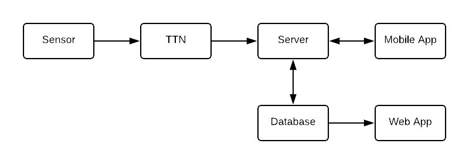

### Data flow and Network Architecture Diagram



# Sensor

Air pollution sensor IoT device.

Created by Bahareh Zaghari.

Uses the Sensiron Particulate Matter Sensor SPS30.

Sends data to The Things Network (TTN)

# TTN

Received messages from IoT devices and sends them to registered listeners (application)

TTN Storage Integration

Collects upstream data (data from sensor) and stores for 7 days.

Serves the data via a simple REST API.

# Server (API + TTN listener + DB)

Server is fairly simple, written in Node.js and TypeScript.

#### TTN Listener

Gets data from TTN provider:

Registers as a listener for the TTN account - receives all messages in real-time from sensors.

Can poll REST API to get all messages over last 7 days.

#### Firebase (Firestore)

Adds the sensor messages data to the database.

General structure of message is:
```
{
  timestamp: number (Unix epoch time in milliseconds)
  lat: number
  lng: number
  value: number (air pollution value)
  sensorID: string (unique ID of sensor)
}
```

#### API

Server has an API to:

Mobile App:

- Create users and associate them with their sensor
- Let users retrieve heatmap data of current air pollution
- Let users retrieve heatmap data of where data is needed - related to incentives

Web App:

- Let authenticated project supervisors have access to all data

# Web App

The web app is written is plain Javascript (+ HTML & CSS) and compiled with Babel and Webpack.

Uses Google Maps to display data visualisations.

Connects to Firebase Firestore to access all air pollution and treatment data.

# Mobile App

Still in progress. Half implemented in Ionic - reimplementing in React Native.

Will allow users to link their sensors.

Will display current air pollution / data need heatmap.

Might need to periodically send location to track sensor.

# Setup

#### Credentials

Firebase Firestore - ask me or create new database.

The Things Network - ask me or Bahareh for details.

These files can be seen in the `.gitignore` file or by trying to run the program.

#### Dependencies

Install `npm` or `yarn` globally. I highly recommend using yarn!

Install project dependencies after cloning with `yarn` or `npm install`

#### Deploying

Project is not deployed yet, instructions will be updated.
Most likely Heroku or Firebase.